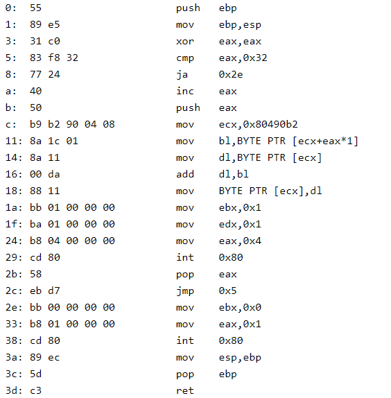

# Binary World (Ring 4)

## CATEGORY

Reversing

## Challenge

In the computer universe, there is only 1 or 0.

[Challenge File](./Resources/binary_world.zip)

## Solution

Observe that each line has nice length of some multiple of 8. Thus we translate them from binary to hex (using Cyberchef) and the result looks like Assembly opcode. 

Throw into [online disassembler](https://defuse.ca/online-x86-assembler.htm#disassembly2) and the Assembly code is as follows.



The last line after "ret", 43 00 01 00 ... , are likely some data (flag). 

Now we need to figure out what the asm code is doing:

`eax` is first set to 0, then checked if `>=0x32`, followed by a jump and increment. So `eax` seems to be a counter for the loop.

What da loop doing?

`dl` is the byte at position `ecx`, `bl` is the byte at position `ecx+eax`.

Assume the data 43 00 01 ... is the byte array that's being operated on,
the code is doing `array[ecx] += array[ecx+eax]` where `eax` is the loop counter.

Mimic the logic in python and we spot the "CDDC22" pattern as shown below, but the number is off by 67. Fix that and get flag.

```
by = "43 00 01 00 ff ef 00 49 d3 e2 47 e2 d7 45 ce f1 3a d5 ed 3d 00 08 f9 c3 32 fe 13 bf 24 da 43 f4 da ef 3d c6 3e 07 de d9 42 fa f8 bd 5c"
by = by.split()
by = list(map(lambda x:int(x,16), by))

ecx = 0
for eax in range(len(by)):
    temp = by[ecx] + by[ecx+eax]
    temp %= 256
    by[ecx] = temp
    # print(temp, end=' ')
    print(chr(temp-67),end='')
```

```
# Output of the first print (Off by 67)
#C   C   D   D   C   2   2  ...
134 134 135 135 134 117 117 190 145 115 186 156 115 184 134 119 177 134 115 176 176 184 177 116 166 164 183 118 154 116 183 171 133 116 177 119 181 188 154 115 181 175 167 100 192 
```

## Flag

CDDC22{N0wY0uC4nC0mmun1cat3W1thB1n4ryW0rld!}

