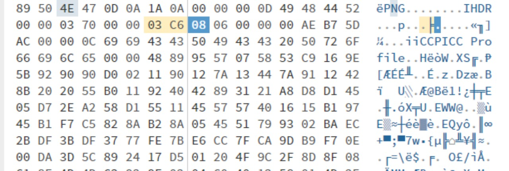

# Unknown File (Ring 5)

## CATEGORY

Forensic

## Challenge

I don't know what kind of file this is.
Open the file and Get the flag!

[Challenge File](./Resources/Unknown_file.zip)

## Solution

Paste the txt data into hex.it as hex. (Recognize that 89 50 4E 47 are the file signature for png images.)

Export as png but the flag isn't visible. Inspecting the metadata shows a mismatch of actual image size and shown size. 

> Metadata: 880*966
> 
> File Details: 880*700

Edit the height in hex editor to match the metadata. Export png and read flag. 

## A Quick Note on PNG Format

PNG format stores data in chunks. ([check out this wonderful site](https://www.nayuki.io/page/png-file-chunk-inspector#:~:text=A%20PNG%20file%20is%20composed,depend%20on%20the%20chunk%20type))

The first 8 bytes are always the file signature 89 50 4E 47 ...

Then starts the chunks. In each chunk, first 4 bytes represent the data length, next 4 bytes are the type code, and last 4 bytes represent the CRC-32 checksum (for error detection).
Inbetween them is the data.

The first chunk is usually the one containing information of the dimension and other properties. These information determines how softwares display the image.

In this challenge for example, the height parameter was editted, causing the flag to not be displayed. 

Challenges could also make use of CRC-32 checksum to ask players to fix the file.  

## Flag

CDDC22{S6oW_me_y0u're_4he_8est}
