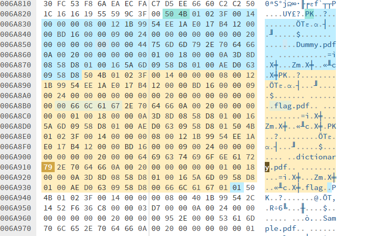

# Unknown File 2 (Ring 5)

## CATEGORY

Forensic

## Challenge

I don't know what kind of file this is.

I think it's written in white...

Open the file and Get the flag!

[Challenge File](./Resources/Unknown_file_2.zip)

## Solution

Open in hex editor and recognize that the file is a zip (start with PK).

The central directory shows 4 files (zip is extracted according to CD).

In hex editor, if we search for 'PK', we can locate the data of the individual files. This way we notice 2 files not listed in the CD - Flag.pdf and dictionary.pdf.

Anyhow add them into the CD. (copy bytes from the other CD listing and change file name). Fortunately, we are still able to extract the files properly.



Dictionary.pdf is a wordlist.
Use that wordlist and python script to break password for Flag.pdf. 

```
import pikepdf
from tqdm import tqdm

# load password list
passwords = [ line.strip() for line in open("passwordlist.txt") ]

# iterate over passwords
for password in tqdm(passwords, "Decrypting PDF"):
    try:
        # open PDF file
        with pikepdf.open("Flag.pdf", password=password) as pdf:
            # Password decrypted successfully, break out of the loop
            print("[+] Password found:", password)
            break
    except pikepdf._qpdf.PasswordError as e:
        # wrong password, just continue in the loop
        continue
```

Flag.pdf turns out to be a blank looking file.

As hinted by question description, use `adobe reader -> file -> extract pdf to text` and get flag written in white. 

## Flag

CDDC22{T6is_is_4he_9re@tes4_D@y_0f_my_1ife!}

