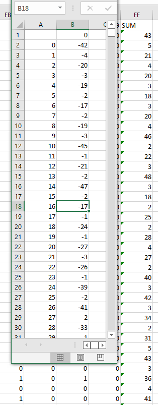

# Logical Computers

## CATEGORY

Misc.

## Challenge

Teaching computers is like teaching children, you gotta start simple.

Today I taught it to recognize the flag!

MD5 (dist.zip) = 67cf4564a54cdc2164b2a71892ad777a

david tan

[Challenge File](./Resources/logical_computers.zip)

## Solution

Use [Netron](https://netron.app/) to get an overview of the ML model given. The details of the model is as follows.

> Flag (length 20) to model input (160x1):
>
> Each char is converted to its ascii number and then 8 binary digits reversed (with 0 replaced with -1)
>
> e.g. 'g' -> 103 -> 01100111 -> [1,1,1,-1,-1,1,-1]

> Layer 1:
>
> layer1_weight (1280x160) x input (160x1) + layer1_bias (1280x1) = layer1_output(1280x1)
>
> activation function: `lambda x:1 if x>0 else -1`
>
> layer2_input = activation(layer1_output)

> Layer 2:
>
> layer2_weight (1x1280) x layer2_input (1280x1) - 1279 = layer2_output
>
> activation(layer2_output) = 1

**Solving for flag**

Reversing the process by deduction:

`layer2_output > 0` $\to$ `layer2_output == 1` $\to$ `layer2_input == layer2_weight`

Then we take a look at [layer 1 bias](./Resources/layer1_bias.csv) and [layer 1 weights](./Resources/layer1_weight.csv) summed by row. 

This pattern suggests that the maximum possible value of each element in layer1_output is 1.

If `layer2_input[i] == 1`, then `layer1_output[i] == 1`.

So 

$$
\forall i\ s.t.\ layer2\\_input\[i\] = 1,
$$

$$
layer1\\_weight\[i\]\[j\]=1 \Rightarrow input\[j\] =1.\ (j=0,1 \cdots 159 )
$$

That provides enough info to recover the flag. [Solve script here.](./Resources/logical_computer_solver.py)

## Flag

grey{sM0rT_mAch1nE5}

